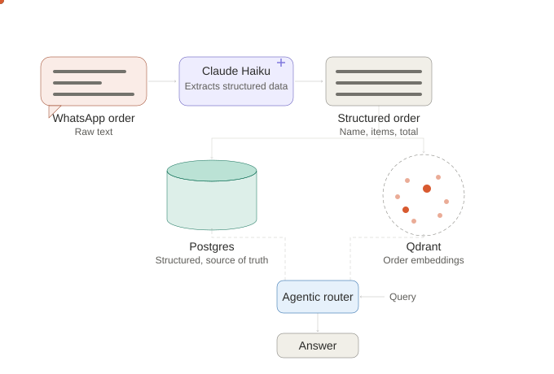
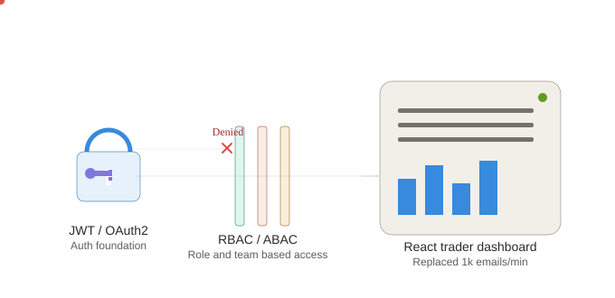
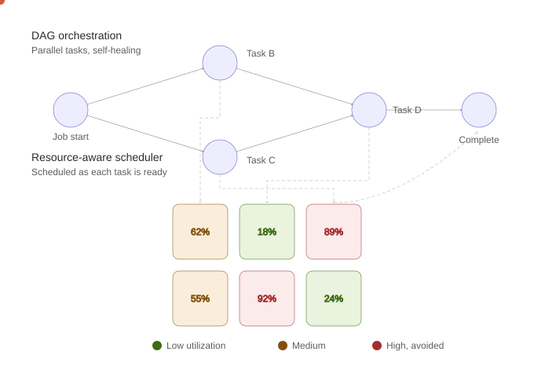
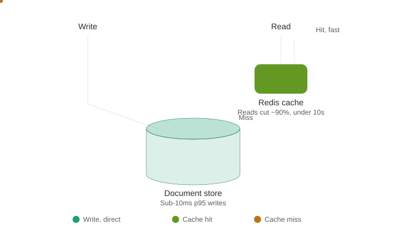
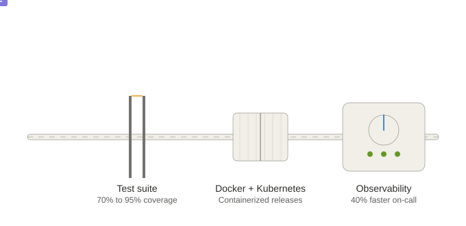

# Vaibhavi Phalle

**Software Engineer · Distributed Systems · AI Infrastructure**

📍 San Jose, CA · ✉️ [vphalle82@gmail.com](mailto:vphalle82@gmail.com) · 💼 [LinkedIn](https://www.linkedin.com/in/vaibhaviphalle/) · 🖥️ [GitHub](https://github.com/VaibhaviPhalle)

Software engineer with 3 years building distributed systems and high-throughput backend services at Bank of America, backed by strong fundamentals in OOP, data structures, and system design. I build end to end, from schema design to production monitoring, and have recently extended that into AI infrastructure, shipping a RAG system and a distributed rate limiter to production quality.

---

## Work Experience, Visualized

Five systems built across two years at Bank of America and an ongoing AI infrastructure build for a family business. Each diagram is the mechanism, not a bullet list — motion included.

### LLM extraction and agentic query system

A raw WhatsApp order gets parsed by Claude Haiku into structured data, written to both a relational store and a vector index, and an agentic router picks the right one per query.

### Trader dashboard access flow

Identity unlocks access, RBAC/ABAC gates it by role, and only authorized requests ever reach the dashboard.

### DAG orchestration with parallel scheduling

Independent tasks schedule onto the compute grid the moment they're ready, placed by live node utilization rather than a fixed queue.

### Data and caching layer

Writes go straight to the store; reads hit a cache first, with only the rare miss falling through to the document store itself.

### Reliability and visibility

Every release passes through tests before it ships, then runs under active observability and on-call once it's live.

---

## Experience

**Ganesh Sales — Software Engineer**
*03/2025 – Present*
- Built an LLM extraction pipeline with Claude Haiku, converting WhatsApp orders into validated, structured data.
- Building a hybrid retrieval system combining Qdrant embeddings with Postgres for semantic order search.
- Building an agentic query layer with LLM tool calling, routing between SQL and vector tools.

**Bank of America — Software Development Engineer I**
*Jul 2023 – Nov 2024*
- Architected DAG-based pipeline orchestration for distributed data workflows, using the same jobs-as-code pattern as Airflow. Added automated failure recovery so jobs self-healed without manual restarts, cutting intervention by 30%.
- Built centralized observability, including log aggregation, alerting thresholds, and real-time dashboards, then owned on-call triage against that instrumentation, cutting mean incident-detection time by 40%.
- Engineered REST APIs in FastAPI and Redis, powering a real-time dashboard with multi-table aggregations. Reduced page load latency by 60%, from 3.5s to under 1.2s.
- Designed RBAC and ABAC access control for a trader-facing dashboard, gating data by role and team attribute so traders, developers, and other teams each saw only their own view of the data.
- Refactored core services into modular, well-tested OOP components, redesigning interfaces so schema changes no longer touched downstream consumers, choosing queues for ordered dispatch and dictionaries for fast lookups as part of that redesign. Lifted engineering productivity by 25% and cut CPU lock-wait time by 40% under concurrent load.
- Built a trader-facing dashboard in ReactJS that replaced a firehose of roughly 1,000 emails per minute during peak windows with dedicated, filterable views, reading data directly from the database and rendering it across multiple visualization sub-panels.

**Bank of America — Senior Technology Associate**
*Jul 2022 – Jul 2023*
- Built a real-time transaction-processing service on a distributed, document-oriented key-value store, comparable to MongoDB. Handled millions of daily transactions at sub-10ms p95 write latency with synchronous write acknowledgment for durability.
- Used Redis as a distributed caching layer for report-generation queries, cutting database read time by nearly 90%, from 1.5 minutes to under 10 seconds.
- Took ownership of unit and integration test coverage across every production repository, raising it from 70% to 90–95%, making regressions a pre-deploy problem instead of a production one.
- Implemented authentication and authorization for internal services using OAuth2, Bearer Token, and JWT, laying the identity layer that the RBAC and ABAC system was later built on.
- Led the migration to containerized Docker deployments on Kubernetes-adjacent CI/CD pipelines, strengthening release reliability.

**LogisticsNow — Software Engineering Intern**
*Oct 2021 – May 2022*
- Built Kafka producer-consumer pipelines for asynchronous event processing.
- Developed a Selenium-based automated test suite, catching production-blocking bugs pre-release.

---

## Skills

**Fundamentals:** Object-oriented programming, data structures, algorithms, system design
**Languages & Systems:** Python, C++, FastAPI, REST APIs, OAuth2, JWT
**Databases & Infra:** AWS, gRPC, PostgreSQL, Kafka, MongoDB, Redis, Kubernetes, CI/CD, Apache Airflow, Datadog
**AI Infra & Tools:** Claude Code, Hugging Face, RAG, evaluation pipelines, MCP, agent-driven development

---

## Projects

**[DistribuGate](https://github.com/VaibhaviPhalle/distributed_rate_limiter)** — A distributed rate-limiting API gateway (FastAPI, Redis/Lua atomic scripting, Postgres config store). Load-tested with Locust: 1,438 requests, 0 failures, 18ms P99 latency added.

**RAG Docs Assistant** — A hybrid-retrieval RAG pipeline (FastAPI, Qdrant, Ollama, OpenTelemetry, Ragas, GitHub Actions) with automated, Ragas-gated CI/CD evals. *[repo link needed]*
